# GPX Charts

A command-line tool and library for elevation charts from GPX files.

## Installation

Install Golang and:

    go install github.com/tkrajina/gpxchart/cmd/gpxchart/...

## Usage

```
pxchart [option] in_file.gpx out_file.png
gpxchart [option] in_file.gpx out_file.svg

Usage of gpxchart:
  -cp string
        Chart padding (left,down,right,up) (default "20,5,20,10")
  -d    Debug
  -f string
        Both axes font size (x,y) (default "8,8")
  -g string
        Grid lines (x,y) (default "0,0")
  -help
        Help
  -im
        Use imperial units (mi, ft)
  -l string
        Labels (x,y) (default "0,0")
  -lw float
        Line width (default 0.5)
  -p string
        Padding (left,down,right,up) (default "40,20,0,0")
  -s string
        Size (width,height) (default "900,200")
  -sme
        Smooth elevations
  -srtm
        Overwrite elevations from SRTM
  -t string
        Type (elevation or speed) (default "elevation")
```

Every time you run gpxcharts, it will save the resulting image and a file ending with `.gpxchars_opts`.
That file contains all the parameters used to generate it.

      $ gpxchart -f 20,10 zbevnica.gpx zbevnica.png
      Saved opions file zbevnica.gpxchars_opts
      Saved chart to zbevnica.png

You can edit that file and/or use it to re-generate the image:

      $ gpxchart zbevnica.gpxchars_opts 
      Using options: -f 20,10 zbevnica.gpx zbevnica.png
      Saved opions file zbevnica.gpxchars_opts
      Saved chart to zbevnica.png

## Examples


### Simple

`gpxchart  test_files/zbevnica.gpx examples/simple.png`

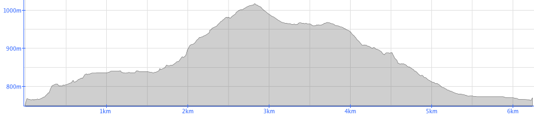

### With smoothed elevations

`gpxchart -sme test_files/zbevnica.gpx examples/smoothed.png`

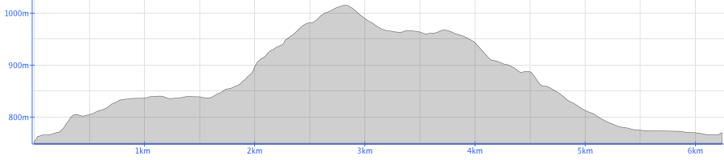

### With SRTM elevations

`gpxchart -srtm test_files/zbevnica.gpx examples/with_srtm_elevations.png`

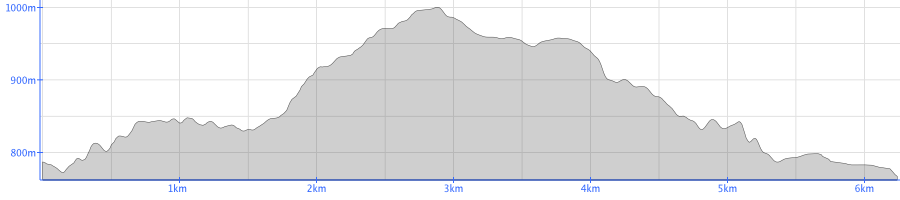

### SVG output

`gpxchart -s 200,100 test_files/zbevnica.gpx examples/simple.svg`


### Imperial units

`gpxchart -im test_files/zbevnica.gpx examples/imperial.png`

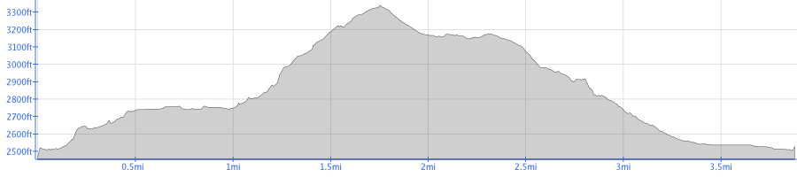

### Custom size

`gpxchart -s 900,300 test_files/zbevnica.gpx examples/custom_size.png`

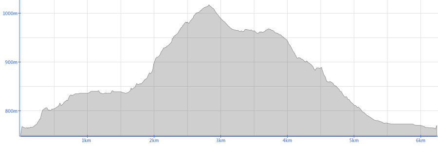

### Custom line width

`gpxchart -lw 2 test_files/zbevnica.gpx examples/thicker_line.png`

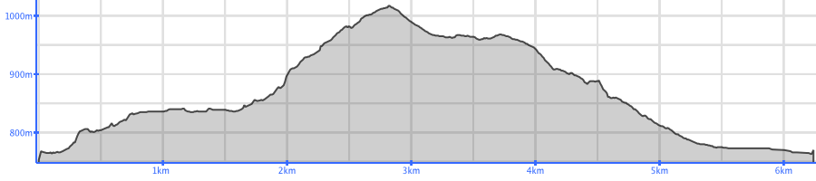

### No padding

`gpxchart -p 0,0,0,0 test_files/zbevnica.gpx examples/no_padding.png`

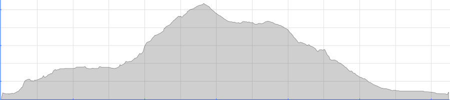

### Padding

`gpxchart -p 50,20,20,20 test_files/zbevnica.gpx examples/custom_padding.png`

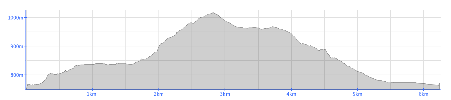

### Custom font size

`gpxchart -p 100,20,0,0 -f 10,20 test_files/zbevnica.gpx examples/custom_font_size.png`

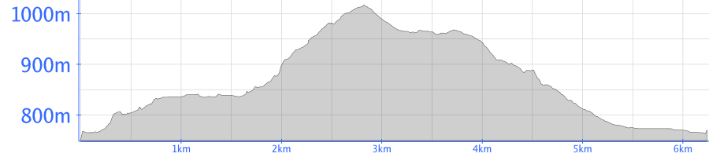

### Custom grid

`gpxchart -g 50,20 test_files/zbevnica.gpx examples/custom_grid.png`


### Custom labels

`gpxchart -l 250,20 test_files/zbevnica.gpx examples/custom_labels.png`

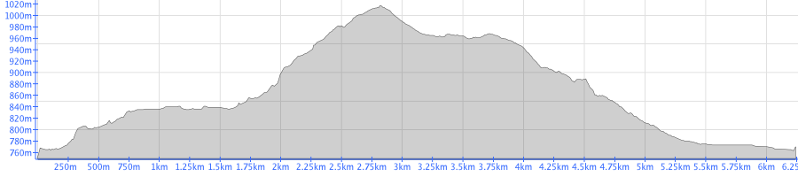

### Custom chart padding

`gpxchart -cp 500,50,500,50 test_files/zbevnica.gpx examples/custom_chart_padding.png`

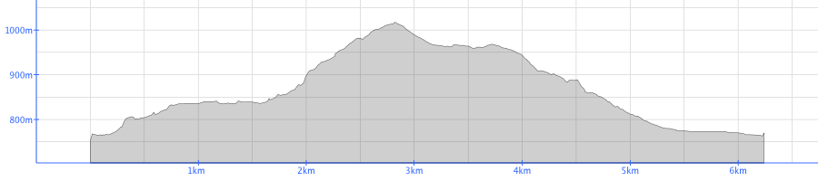


# License

**gpxcharts** is licensed under the [Apache License, Version 2.0](http://www.apache.org/licenses/LICENSE-2.0)
